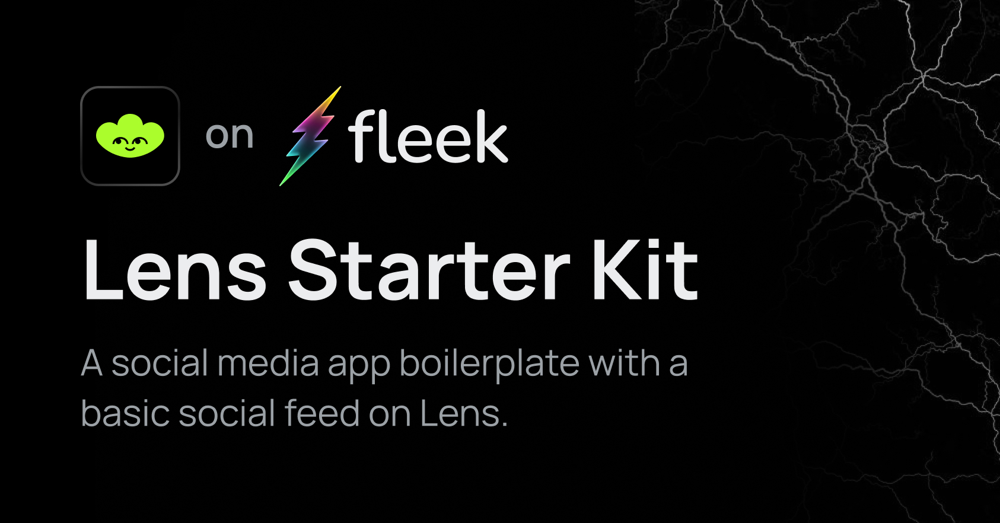

# Lens Protocol + Fleek Starter Kit 🌿



This is an example frontend app made by [Nader Dabit](https://twitter.com/dabit3) to start to build on top of [Lens Protocol](https://www.lens.xyz/). 

## 🚀 Project Structure

```
/
├── abi/
│   └── lenshub.json
│   └── lensperiphery.json
├── api/
│   └── index.js
│   └── mutations.js
│   └── queries.js
├── components/
│   └── index.js
│   └── ...
├── pages/
│   └── profile/
│   └── index.js
│   └── _app.js
│   └── ...
├── public/
│   └── ...
├── styles/
│   └── ...
└── package.json
└── ...
```

## 🧞 Commands

All commands are run from the root of the project, from a terminal:

| Command                | Action                                           |
| :--------------------- | :----------------------------------------------- |
| `pnpm install`         | Installs the project dependencies      |
| `pnpm run dev`         | Starts local dev server at `localhost:3001`      |
| `pnpm run build`       | Build your production site to `./out/`           |
| `pnpm run start`       | Preview your build locally, before deploying     |
| `pnpm run lint`        | Runs eslint                                      |


## Run the project 
> This project has a dependency on having a Infura IPFS API Key used on `uploadToIPFS()`. <br/>
> Setup your Infura keys in `env.local`. You can check `example.env.local` for reference.

You can checkout Lens [documentation](https://docs.lens.xyz/docs/introduction) and [available functions](https://docs.lens.xyz/docs/functions).

The main API calls used in this app are defined in __api/index.js__:

| Method                 | Result                                           |
| :--------------------- | :----------------------------------------------- |
| [recommendProfiles](https://docs.lens.xyz/docs/recommended-profiles#api-details) | Get popular profiles |
| [getProfiles](https://docs.lens.xyz/docs/get-profiles) | Get profiles by passing in an array of `profileIds` |
| [getPublications](https://docs.lens.xyz/docs/get-publications) | Returns a list of publications based on your request query |
| [searchProfiles](https://docs.lens.xyz/docs/search-profiles-and-publications) | Allows a user to search across hashtags on publications or profile handles. This query returns either a Post and Comment or Profile. |
| [follow](https://docs.lens.xyz/docs/functions#follow) | Follow a user |
| [burn](https://docs.lens.xyz/docs/functions#burn) | Unfollows a user |
| [timeline](https://docs.lens.xyz/docs/user-timeline) | Shows a feed of content tailored to a signed in user |
| [createSetProfileMetadataTypedData](https://docs.lens.xyz/docs/create-set-update-profile-metadata-typed-data) | Allows a user to update the metadata URI for their profile |
| [post](https://docs.lens.xyz/docs/functions#post) | Allows a user to publish content |


## ⚡ How to deploy to Fleek

### 1. Create a `fleek.json` config file:
You can configure this site deployment using [Fleek CLI]() and running:
```
 > fleek sites init
  WARN! Fleek CLI is in beta phase, use it under your own responsibility
   ? Choose one of the existing sites or create a new one. › 
    ❯ Create a new site
```
 It will prompt you for a `name`, `dist` directory location & `build command`

 - `name`: How you want to name the site
 - `dist`: The output directory where the site is located, for this template it's `dist`
 - `build command`: Command to build your site, this will be used to deploy the latest version either by CLI or Github Actions

### 2. Deploy the site
After configuiring your `fleek.json` file, you can deployt the site by running

```
fleek sites deploy
```
After running it you will get an output like this:
```
 WARN! Fleek CLI is in beta, use it at your own discretion
  > Success! Deployed!
   > Site IPFS CID: QmTf8fUabGohaRztcbXuZCEZ46hrRrCswVPYrquLezWFRF

    > You can visit through the gateway:
     > https://ipfs.io/ipfs/QmTf8fUabGohaRztcbXuZCEZ46hrRrCswVPYrquLezWFRF
```

### Extra features
- **Continuous Integration (CI):** `fleek sites ci` [Documentation.](https://docs.fleek.xyz/services/sites/#continuous-integration-ci)
- **Adding custom domains:** `fleek domains create` [Documentation.](https://docs.fleek.xyz/services/domains/)


## Build3rs Stack Lens Protocol 

You can learn more about [Lens](https://www.lens.xyz/) visiting our Build3rs Stack - web3 infrastructure overview series in the official [Fleek Blog](https://blog.fleek.xyz/). Where we provide a [developer guide](https://blog.fleek.xyz/post/builders-stack-lens-protocol/) to start to build with it. 

